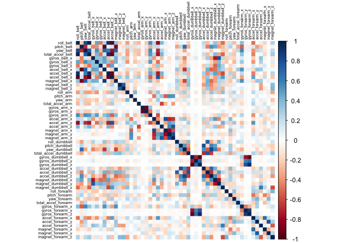
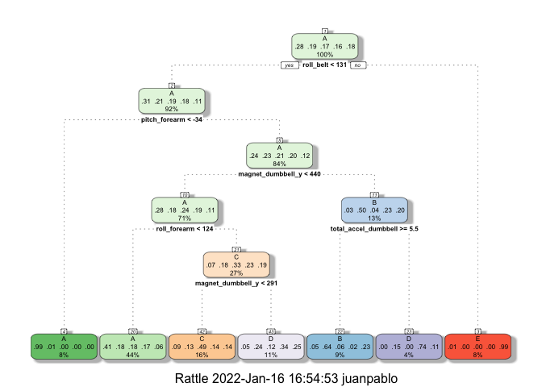
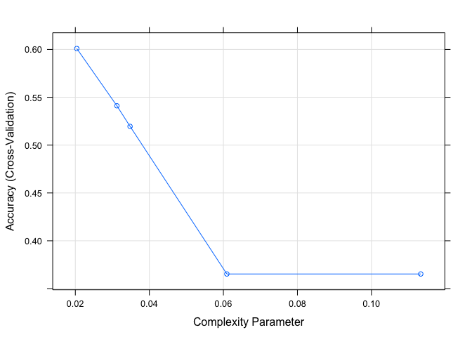
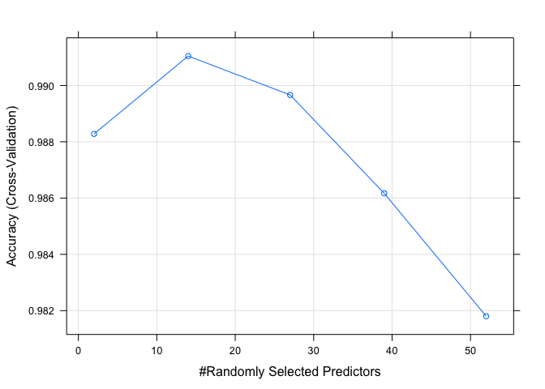
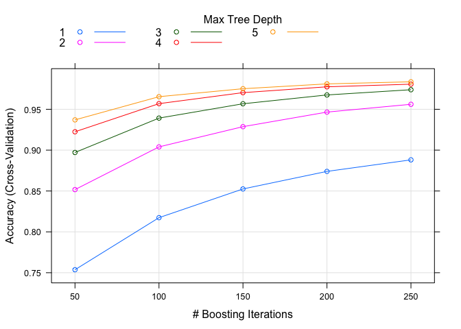

--------
Github Repository: [Github-juanpaat](https://github.com/juanpaat/Machine-Learning-Project.git)  
 
This document holds the final project for the Coursera "practical Machine Learning" course. Here we analyse data from accelerometers on the belt, forearm, arm, and dumbell of 6 participants to predict the way in which they did the exercise.  
 
## Background  
Using devices such as Jawbone Up, Nike FuelBand, and Fitbit it is now possible to collect a large amount of data about personal activity relatively inexpensively. These type of devices are part of the quantified self movement – a group of enthusiasts who take measurements about themselves regularly to improve their health, to find patterns in their behavior, or because they are tech geeks. One thing that people regularly do is quantify how much of a particular activity they do, but they rarely quantify how well they do it. In this project, your goal will be to use data from accelerometers on the belt, forearm, arm, and dumbell of 6 participants. They were asked to perform barbell lifts correctly and incorrectly in 5 different ways. More information is available from the website here: http://groupware.les.inf.puc-rio.br/har (see the section on the Weight Lifting Exercise Dataset).   

## Data   
The training data for this project are available here:   
https://d396qusza40orc.cloudfront.net/predmachlearn/pml-training.csv  

The test data are available here:  
https://d396qusza40orc.cloudfront.net/predmachlearn/pml-testing.csv   

The data for this project come from this source:   http://groupware.les.inf.puc-rio.br/har.  
 
 
Fist thing first, we load the packages that will be needed in order to get the best model and forecast the the manner in which some people did the exercise.  

```
## Loading required package: ggplot2
```

```
## Loading required package: lattice
```

```
## Loading required package: tibble
```

```
## Loading required package: bitops
```

```
## Rattle: A free graphical interface for data science with R.
## Version 5.4.0 Copyright (c) 2006-2020 Togaware Pty Ltd.
## Type 'rattle()' to shake, rattle, and roll your data.
```

```
## randomForest 4.6-14
```

```
## Type rfNews() to see new features/changes/bug fixes.
```

```
## 
## Attaching package: 'randomForest'
```

```
## The following object is masked from 'package:rattle':
## 
##     importance
```

```
## The following object is masked from 'package:ggplot2':
## 
##     margin
```

```
## Loaded gbm 2.1.8
```

```
## 
## Attaching package: 'kernlab'
```

```
## The following object is masked from 'package:ggplot2':
## 
##     alpha
```

```
## corrplot 0.92 loaded
```


Here we download the data directly from the link, to do that we used the read.csv function and then asigned the data to a RawTraining and Test variable.  

```r
RawTraining <- read.csv(url("https://d396qusza40orc.cloudfront.net/predmachlearn/pml-training.csv"))

Test<-read.csv(url("https://d396qusza40orc.cloudfront.net/predmachlearn/pml-testing.csv"))
```


## Cleaning the data  
In order to work with the data that contain insights, first we removed the NAs values and second, the first 7 rows that contain information about the participants and other metadata are removed as well.  

```r
Training <- RawTraining[,colMeans(is.na(RawTraining)) < .9] 
Training <- Training[,-c(1:7)]
```

Using the nearZeroVar() function from the caret package, we find and then remove the variables that are hace zero or almost zero variability because they will not help to build our models and may cause noise or make harder the computation.

```r
nvz <- nearZeroVar(Training)
Training <- Training[,-nvz]
```

## split the data
In order to create a model we need to split the data into train set (70% of the data) and valid set (30% of the data). To do that we use the createDataPartition function from the carot package.  

```r
inTrain <- createDataPartition(y=Training$classe, p=0.7, list=F)
train <- Training[inTrain,]
valid <- Training[-inTrain,]
```


## Correlation matrix of variables in training set
Here we plot the heat map with the correlation values of the variables after cleaning and removing the noise.  For that we use the corrplot function from the corrplot package using the train dataset.

```r
corrPlot <- cor(train[, -length(names(train))])
corrplot(corrPlot, method="color",tl.col = "black",tl.cex = 0.5)
```

<!-- -->


## Creating a Model  
To create a model we set up control for training to use 3-fold cross validation.

```r
control <- trainControl(method="cv", number=3, verboseIter=F)
```

## Support Vector Machine

```r
model_svm <- train(classe~., data=train, method="svmLinear", trControl = control, tuneLength = 5, verbose = F)
pred_svm <- predict(model_svm, valid)
cmsvm <- confusionMatrix(pred_svm, factor(valid$classe))
cmsvm
```

```
## Confusion Matrix and Statistics
## 
##           Reference
## Prediction    A    B    C    D    E
##          A 1554  166   85   66   64
##          B   35  820   92   37  148
##          C   43   61  811  106   64
##          D   34   27   18  701   55
##          E    8   65   20   54  751
## 
## Overall Statistics
##                                           
##                Accuracy : 0.7879          
##                  95% CI : (0.7773, 0.7983)
##     No Information Rate : 0.2845          
##     P-Value [Acc > NIR] : < 2.2e-16       
##                                           
##                   Kappa : 0.7301          
##                                           
##  Mcnemar's Test P-Value : < 2.2e-16       
## 
## Statistics by Class:
## 
##                      Class: A Class: B Class: C Class: D Class: E
## Sensitivity            0.9283   0.7199   0.7904   0.7272   0.6941
## Specificity            0.9095   0.9343   0.9436   0.9728   0.9694
## Pos Pred Value         0.8031   0.7244   0.7475   0.8395   0.8363
## Neg Pred Value         0.9696   0.9329   0.9552   0.9479   0.9336
## Prevalence             0.2845   0.1935   0.1743   0.1638   0.1839
## Detection Rate         0.2641   0.1393   0.1378   0.1191   0.1276
## Detection Prevalence   0.3288   0.1924   0.1844   0.1419   0.1526
## Balanced Accuracy      0.9189   0.8271   0.8670   0.8500   0.8317
```

## Random Forest  

```r
model_rf <- train(classe~., data=train, method="rf", trControl = control, tuneLength = 5)
pred_rf <- predict(model_rf, valid)
cmrf <- confusionMatrix(pred_rf, factor(valid$classe))
cmrf
```

```
## Confusion Matrix and Statistics
## 
##           Reference
## Prediction    A    B    C    D    E
##          A 1673    7    0    0    0
##          B    1 1131    2    0    0
##          C    0    1 1024   12    1
##          D    0    0    0  951    4
##          E    0    0    0    1 1077
## 
## Overall Statistics
##                                           
##                Accuracy : 0.9951          
##                  95% CI : (0.9929, 0.9967)
##     No Information Rate : 0.2845          
##     P-Value [Acc > NIR] : < 2.2e-16       
##                                           
##                   Kappa : 0.9938          
##                                           
##  Mcnemar's Test P-Value : NA              
## 
## Statistics by Class:
## 
##                      Class: A Class: B Class: C Class: D Class: E
## Sensitivity            0.9994   0.9930   0.9981   0.9865   0.9954
## Specificity            0.9983   0.9994   0.9971   0.9992   0.9998
## Pos Pred Value         0.9958   0.9974   0.9865   0.9958   0.9991
## Neg Pred Value         0.9998   0.9983   0.9996   0.9974   0.9990
## Prevalence             0.2845   0.1935   0.1743   0.1638   0.1839
## Detection Rate         0.2843   0.1922   0.1740   0.1616   0.1830
## Detection Prevalence   0.2855   0.1927   0.1764   0.1623   0.1832
## Balanced Accuracy      0.9989   0.9962   0.9976   0.9929   0.9976
```

## Decision Tree

```r
model_trees <- train(classe~., data=train, method="rpart", trControl = control, tuneLength = 5)
fancyRpartPlot(model_trees$finalModel)
```

<!-- -->


```r
pred_trees <- predict(model_trees, valid)
cmtrees <- confusionMatrix(pred_trees, factor(valid$classe))
cmtrees
```

```
## Confusion Matrix and Statistics
## 
##           Reference
## Prediction    A    B    C    D    E
##          A 1509  482  489  438  164
##          B   23  348   32    7  116
##          C   86  118  429  137  119
##          D   49  191   76  382  173
##          E    7    0    0    0  510
## 
## Overall Statistics
##                                           
##                Accuracy : 0.54            
##                  95% CI : (0.5272, 0.5528)
##     No Information Rate : 0.2845          
##     P-Value [Acc > NIR] : < 2.2e-16       
##                                           
##                   Kappa : 0.4003          
##                                           
##  Mcnemar's Test P-Value : < 2.2e-16       
## 
## Statistics by Class:
## 
##                      Class: A Class: B Class: C Class: D Class: E
## Sensitivity            0.9014  0.30553   0.4181  0.39627  0.47135
## Specificity            0.6265  0.96249   0.9053  0.90063  0.99854
## Pos Pred Value         0.4896  0.66160   0.4826  0.43858  0.98646
## Neg Pred Value         0.9411  0.85240   0.8805  0.88393  0.89344
## Prevalence             0.2845  0.19354   0.1743  0.16381  0.18386
## Detection Rate         0.2564  0.05913   0.0729  0.06491  0.08666
## Detection Prevalence   0.5237  0.08938   0.1511  0.14800  0.08785
## Balanced Accuracy      0.7639  0.63401   0.6617  0.64845  0.73495
```


## Gradient Boosted Trees

```r
model_gbm <- train(classe~., data=train, method="gbm", trControl = control, tuneLength = 5, verbose = F)
pred_gbm <- predict(model_gbm, valid)
cmgbm <- confusionMatrix(pred_gbm, factor(valid$classe))
cmgbm
```

```
## Confusion Matrix and Statistics
## 
##           Reference
## Prediction    A    B    C    D    E
##          A 1668    9    0    0    0
##          B    5 1119    3    0    2
##          C    1   10 1017   13    1
##          D    0    1    6  949    7
##          E    0    0    0    2 1072
## 
## Overall Statistics
##                                           
##                Accuracy : 0.9898          
##                  95% CI : (0.9869, 0.9922)
##     No Information Rate : 0.2845          
##     P-Value [Acc > NIR] : < 2.2e-16       
##                                           
##                   Kappa : 0.9871          
##                                           
##  Mcnemar's Test P-Value : NA              
## 
## Statistics by Class:
## 
##                      Class: A Class: B Class: C Class: D Class: E
## Sensitivity            0.9964   0.9824   0.9912   0.9844   0.9908
## Specificity            0.9979   0.9979   0.9949   0.9972   0.9996
## Pos Pred Value         0.9946   0.9911   0.9760   0.9855   0.9981
## Neg Pred Value         0.9986   0.9958   0.9981   0.9970   0.9979
## Prevalence             0.2845   0.1935   0.1743   0.1638   0.1839
## Detection Rate         0.2834   0.1901   0.1728   0.1613   0.1822
## Detection Prevalence   0.2850   0.1918   0.1771   0.1636   0.1825
## Balanced Accuracy      0.9971   0.9902   0.9930   0.9908   0.9952
```

## Plotting the models

```r
plot(model_trees)
```

<!-- -->

```r
plot(model_rf)
```

<!-- -->

```r
plot(model_gbm)
```

<!-- -->

**As we could see, the best model is the Random Forest, however the computation is a bit heavy.**  
**The accuracy of this model was about 0.9951 and the error sample rate was 0.0049.**  


## Prediction  
We use the model_rf which is the model of the Random Forest to predict the class of the data in the Test data set, to do that we use the predict function from the carot package.

```r
pred <- predict(model_rf, Test)
print(pred)
```

```
##  [1] B A B A A E D B A A B C B A E E A B B B
## Levels: A B C D E
```
